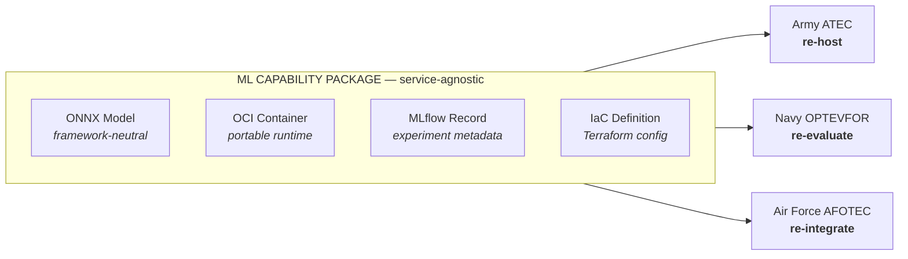

# Vendor-Agnostic AI as an MDO Enabler

**Test, Integration, and Mission Engineering Across the Kill Web**

Sam Bright · Michael Soltys

GBL Systems Corporation

ITEA All/Multi-Domain Operations Forum · July 14–16, 2026 · Huntsville, AL

*"Testing for the Arsenal of Freedom"*

Distribution A — Approved for Public Release

<!--
Companion papers: ITEA Journal Vol. 47, Issue 2 — "Avoiding Vendor Lock-In in AI Procurement" and "Retrieval-Augmented Generation for Departmental T&E."
-->

---

# Vendor Lock-In Degrades the Kill Web

### When Every Node Runs a Different ML Stack

**Army (Project Convergence)** — proprietary training frameworks, custom model formats

**Navy (Project Overmatch)** — vendor-specific inference runtimes

**Air Force (ABMS)** — single-cloud orchestration

Representative risk patterns in vendor-locked ML deployments — illustrative, not assessments of specific program implementations.

### Three Failure Modes That Degrade MDO Mission Threads

- **Porting latency** — a model trained for Project Convergence cannot be re-hosted for Project Overmatch without months of work
- **Cross-classification stall** — proprietary runtimes do not transfer across classification enclaves
- **Test silos** — joint test events lose reproducibility because no two services can re-run the same model on the same data

Vendor lock-in is not an acquisition inconvenience — it is a **structural source of fragility in the kill web**

---

# CJADC2 Requires Interoperability — AI Lock-In Prevents It

### The CJADC2 Mandate

Integrates sensors, processors, decision aids, and effectors spanning **all five domains**: land, air, sea, space, and cyberspace.

| Domain | Capability | Representative Lock-In Risk |
| ------ | ---------- | --------------------------- |
| Land   | Target acquisition (Convergence) | Proprietary training framework + single-cloud dependency |
| Air    | ABMS sensor fusion | Vendor-forked, non-compliant runtime |
| Sea    | Overmatch kill-chain | Single-cloud inference dependency |
| Space  | SDA sensor mesh | Proprietary model format |
| Cyber  | AI threat detection | Platform-tied model serving |

Illustrative risk patterns showing where lock-in can enter each domain — not attributions to specific programs or vendors.

### The Core Tension

AI/ML compresses the sensor-to-shooter timeline — but **only if models can be re-hosted, re-evaluated, and re-integrated** across services without dependency on the original vendor.

Vendor-agnostic AI is not an acquisition preference — it is a **structural requirement of CJADC2**

---

# The Mission Engineering Primitives

### Four Technical Building Blocks That Restore Portability

**1. OCI-Compliant Containers**

Package ML models in Open Container Initiative images. Any OCI-compliant runtime (Docker, Podman, containerd) on any cloud or enclave can execute the workload.

**2. ONNX Model Interchange**

The Open Neural Network Exchange format decouples training from inference. Train in PyTorch or TensorFlow; deploy anywhere ONNX Runtime runs — including air-gapped enclaves.

**3. Infrastructure-as-Code**

Terraform or Pulumi definitions make deployment fully reproducible. A config for AWS GovCloud instantiates on Azure Government or on-premise with parameter changes — not a rewrite.

**4. Vendor-Neutral Experiment Tracking**

MLflow or DVC capture hyperparameters, training data references, dependency specs, and configurations — enabling vendor migration without losing institutional knowledge.

These primitives apply at the same layer where vendor lock-in enters — and compose into a **T&E reproducibility framework**

---

# The T&E Reproducibility Framework

### Packaging for Cross-Service Re-Evaluation

A model packaged under this framework can be **re-hosted, re-evaluated, and re-integrated** by any service's test organization — without vendor dependency.

Role assignments are illustrative — each service T&E organization can perform all three functions from the same package.

**Result:** Any T&E organization can reproduce the test — not just the originating vendor

<!--
OPTEVFOR (Commander, Operational Test and Evaluation Force) is the Navy's operational test organization, paralleling ATEC and AFOTEC. If the developmental-test angle comes up, Navy warfare centers (e.g., NSWC) are the DT counterpart.
-->

---

# Kill-Web Failure Taxonomy

### How Vendor Lock-In Breaks Specific MDO Mission Threads

| Failure Class | MDO Thread Affected | Root Cause |
| ------------- | ------------------- | ---------- |
| **Framework Lock** | Army-to-Navy model transfer (Convergence → Overmatch) | PyTorch checkpoint cannot run on vendor B's serving stack |
| **Runtime Lock** | Air-to-Space sensor fusion (ABMS → SDA) | Vendor fork of ONNX runtime breaks spec compliance |
| **Cloud Lock** | Cross-command AI capability sharing | Model artifact tied to one cloud provider's proprietary lineage/serving format |
| **Enclave Lock** | IL4 → IL6 capability promotion | Container image built with commercial-cloud libraries; no air-gapped equivalent |
| **Observation Lock** | Joint after-action review | Experiment metadata in vendor-proprietary format; cannot replay on peer infrastructure |

Representative failure patterns compiled from the lock-in mechanisms documented in our ITEA Journal companion paper — illustrative mission threads, not incident reports.

Every failure class produces the same outcome: **per-service test silos** that cannot be aggregated into joint mission threads

---

# Three Multi-Domain Test Contexts

### GIDE — the proof it works

**Global Information Dominance Experiments (CDAO)** · Multi-domain AI-enabled decision superiority across combatant commands

**Demonstrated exemplar:** GIDE's vendor-agnostic data integration layers sustained operational availability above 99.5% across combatant commands — validating vendor independence at operational scale (see our ITEA Journal companion paper)

**Framework extension:** OCI images + MLflow records as the standard artifact format for experiment-to-experiment (GIDE-N → GIDE-N+1) model baselines

### ABMS — where the risk lives

**Advanced Battle Management System (Air Force)** · Sensor-to-shooter network across air and space domains

**Lock-in risk (illustrative):** Proprietary inference runtimes would prevent Army and Navy sensor adapters from contributing ML components without full vendor re-engagement

**Framework fix:** ONNX as the interchange format for all ABMS AI nodes

### Project Overmatch — where the risk lives

**Kill-chain automation (Navy)** · Maritime domain kill-chain automation

**Lock-in risk (illustrative):** Models ported from Project Convergence would require months of re-integration; joint test windows missed

**Framework fix:** IaC definitions as the Overmatch re-hosting specification

Vendor-agnostic packaging **shortens cross-service integration timelines** and produces reproducible joint test records

<!--
Framing: GIDE is the positive exemplar (consistent with our published paper); ABMS and Overmatch illustrate the risk the framework prevents. Do not present the ABMS/Overmatch impacts as things that have occurred.
-->

---

# Policy Convergence: WAS + CJADC2

### Two Mandates, One Engineering Answer

### Warfighting Acquisition System

**Secretary Hegseth — WAS memorandum & National War College remarks, November 2025**

- *"Maintain at least two qualified sources for critical program content"* — explicit dual-source mandate targeting lock-in
- *"Speed to capability delivery is now our organizing principle"* — WAS memorandum
- Commercial-first, modular, performance-based contracting
- Recent commercial AI supply-chain disruptions underscore that single-vendor dependency is an operational risk, not just a cost risk (detailed in our ITEA Journal companion papers)

### CJADC2 Operational Requirements

- Joint interoperability across all five domains and coalition partners
- No single service's ML stack can be the authoritative runtime for joint capabilities
- Cross-classification portability: NIPRNet IL4 through SIPRNet IL6

WAS policy + CJADC2 architecture + T&E reproducibility framework = **a single codifiable standard for Joint T&E guidance**

<!--
Attribution note: the dual-source language comes from the November 2025 acquisition reforms as reported; "Speed to capability delivery is now our organizing principle" is verbatim from the WAS memorandum ("Transforming the Defense Acquisition System into the Warfighting Acquisition System"). Speech: Nov 7; formal memoranda released Nov 7–10, 2025.
Verify the supply-chain bullet wording against the companion paper before presenting.
-->

---

# Deploying Across Classification Enclaves

### The Enclave Portability Problem

| Level | Environment | Vendor Lock-In Risk |
| ----- | ----------- | ------------------- |
| **IL4** | NIPRNet (CUI) | Cloud-specific model serving (e.g., managed inference services) |
| **IL5** | Higher-sensitivity CUI / mission-critical unclassified | US-citizen-only enclaves; some ML tooling unavailable |
| **IL6** | SIPRNet (SECRET) | Air-gapped; commercial cloud inference unavailable |
| **DDIL*** | Tactical edge | Disconnected; model must run on organic compute |

* DDIL (denied, degraded, intermittent, limited) is an operating condition, not a DoD impact level — included to complete the deployment continuum.

### Framework Solution Per Level

**IL4 → IL5:** IaC definition parameterizes cloud provider; ONNX model unchanged

**IL5 → IL6:** OCI image carries its own runtime; no internet dependency

**IL6 → DDIL:** Slim OCI image + quantized ONNX model fits on edge compute (Jetson, tactical GPU servers)

The same four primitives that prevent acquisition lock-in **also enable cross-enclave capability promotion**

---

# Recommendations for Joint T&E Guidance

### Codifying Vendor-Agnostic Standards

**1. Mandatory Artifact Standard**

All ML capabilities submitted for Joint T&E events must include: ONNX model export, OCI container image, IaC deployment definition, MLflow experiment record. No proprietary-only artifacts accepted.

**2. Cross-Service Re-Evaluation Requirement**

Every AI capability in a joint test event must be re-hostable by at least one peer-service T&E organization within a defined re-host window (e.g., 30 days), using only the submitted artifact package.

**3. Contract Language**

Incorporate dual-source and open-artifact requirements into AI/ML task order language. Data rights provisions must ensure government ownership of model weights and training metadata.

**4. PAE Integration**

Portfolio Acquisition Executives (established under WAS) should treat vendor-agnostic packaging as a gate criterion for AI capability advancement across program phases.

These four recommendations directly implement the WAS dual-source mandate in the AI/ML domain

<!--
If asked where the 30-day figure comes from: it is our proposed starting point for the re-host window, sized to fit within a typical joint test planning cycle; the principle is a bounded, enforceable window rather than the specific number.
-->

---

# What T&E Practitioners Can Do Now

### Immediate (0–90 Days)

- **Audit current AI/ML contracts** for vendor lock-in provisions; identify capabilities with no second source
- **Require ONNX exports** in all new AI/ML task orders as a deliverable line item
- **Stand up a multi-vendor inference evaluation** to establish a reproducibility baseline

### Near-Term (90–180 Days)

- **Adopt MLflow** as the experiment record standard for all AI T&E events
- **Draft IaC templates** for the most common enclave configurations (IL4 GovCloud, IL5 dedicated, IL6 on-premise GPU)
- **Include cross-service re-host** as a T&E success criterion alongside performance metrics

### Policy Track (Ongoing)

- **Engage PAEs** to incorporate vendor-agnostic packaging criteria into AI/ML source selection
- **Submit to Joint T&E community** for codification in joint test guidance
- **Align with CJADC2 architecture boards** to standardize the artifact format across services

The T&E community is uniquely positioned to champion vendor-agnostic AI — through test criteria, contract language, and cross-service reproducibility standards

---
layout: end
class: text-center
---

# T&E as a Driver of MDO Resilience

### The Problem

Proprietary ML stacks introduce fragmentation that degrades kill-web coherence — making it harder for Army, Navy, and Air Force AI to share models across services, clouds, and classification enclaves.

### The Framework

OCI containers · ONNX interchange · Infrastructure-as-Code · Vendor-neutral experiment tracking

### The Ask

Codify vendor-agnostic packaging in Joint T&E guidance. Make it a test criterion, not a preference.

T&E practitioners are well positioned to help build the **arsenal of freedom**.

Sam Bright · Michael Soltys · GBL Systems Corporation

Distribution A — Approved for Public Release
